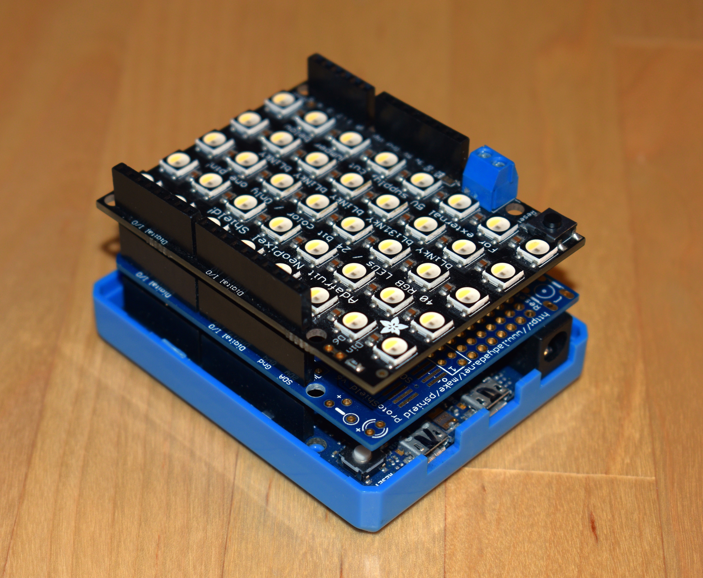
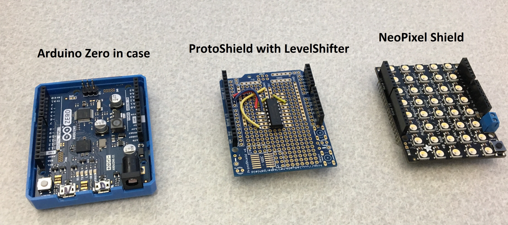
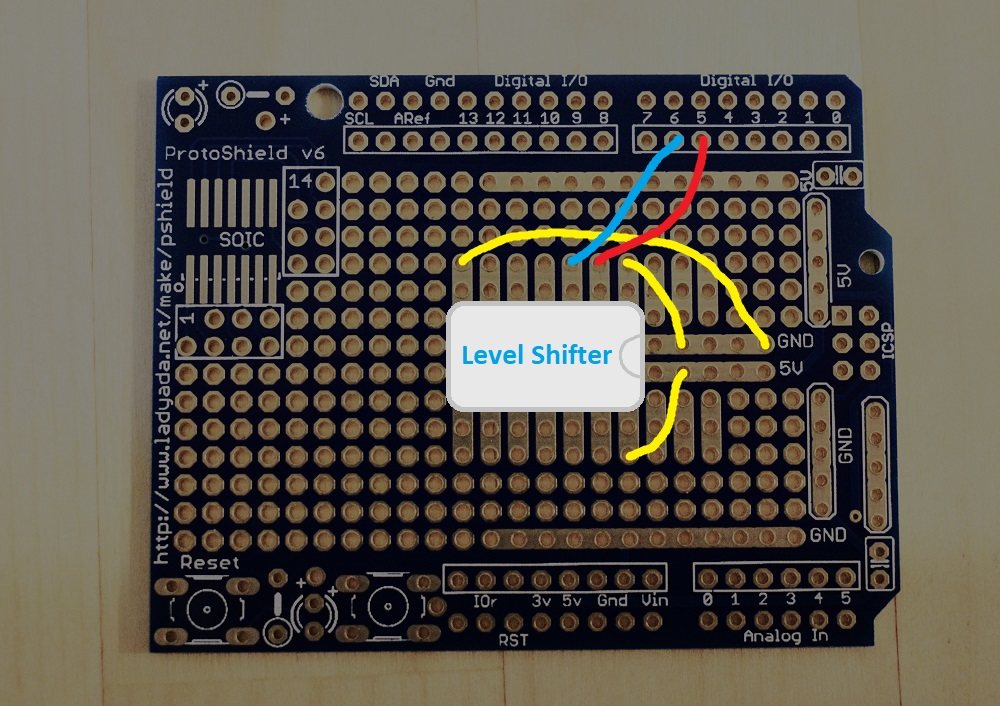
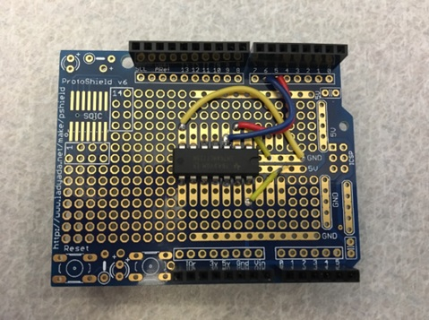
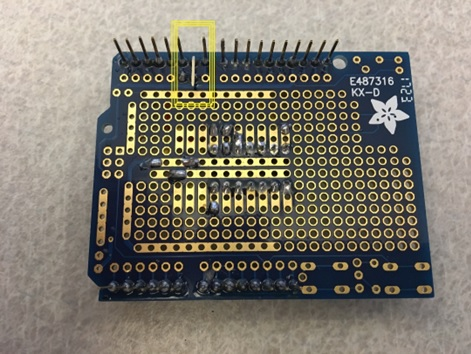

# Background
LampArray devices have one or more Lamps (e.g. lights/LEDs/bulbs, etc…) whose color state can be directly manipulated by the Host (rather than utilizing pre-programmed effects). Static information (stored on the device) describe supported colors, geometric positions and intended purposes for each Lamp.  LampArrays can be found as part of composite devices (e.g. keyboard with RGB lighting) or as standalone.

Windows has supported LampArray manipulation since Windows 10 1809 (build 17763), via the [Windows.Devices.Lights](https://learn.microsoft.com/en-us/uwp/api/windows.devices.lights.lamparray), [Windows.Devices.Lights.Effects](https://learn.microsoft.com/en-us/uwp/api/windows.devices.lights.effects) UWP APIs.

See `Windows 11 Insider Preview Build 23475` for new [Dynamic Lighting](https://blogs.windows.com/windows-insider/2023/06/07/announcing-windows-11-insider-preview-build-23475/) scenarios for LampArrays.

[LampArray HID Usages](https://usb.org/sites/default/files/hut1_4.pdf#page=329) describe the underlying interaction between Host and Device.  This interaction is implemented by `Microsoft_HidLampArray`

# Sample Device Demo
Sample device being driven by application running on Windows Host.

*Note: The device with do nothing by itself, it requires the Host to send Lamp state.*

# Building Sample Device
This section describes the hardware components (constituting the end-device) used for this sample.  Other configurations may require changes to the sample code to integrate with an alternate light-source or development-platform.

*Note: The device with do nothing by itself, it requires the Host to send Lamp state.*

## Design
Adafruit has an excellent series of NeoPixel matrix assemblies. The 40-LED version, being a shield, makes assembly/use very convenient, so the design is focused around this.

An Arduino Zero is chosen because of it's native USB support (via Atmel SAMD21 microcontroller) and friendly EDBG for source-debugging.

While the Arduino Zero has the same pin-header layout as the NeoPixel shield, the shield expects signalling (to PIN6) to be 5V, whereas the Arduino Zero operates at 3.3V.  This difference can be accounted for with a level-shifter, to up-level the voltage.  An Adafruit ProtoShield provides an area for the level-shifter, with PIN5 entering the level-shifter at 3.3V, exiting the level-shifter at 5V to PIN6 (connecting to the NeoPixel shield signalling pin).

These components are then stacked to create the final assembly.

## Components
- [Arduino Zero](https://store-usa.arduino.cc/products/arduino-zero?selectedStore=us)
- [Arduino Zero Case](https://store-usa.arduino.cc/products/arduino-zero-case?variant=40735839748303)
- [74AHCT125 3v-5v Level Shifter](https://www.adafruit.com/product/1787)
- [Adafruit Proto Shield](https://www.adafruit.com/product/2077)
- [Adafruit NeoPixel Shield - 40 RGB](https://www.adafruit.com/product/3053)
- [22 AWG Solid Core](https://www.adafruit.com/product/1311)
- Solder
- Soldering Iron

## ProtoShield Assembly

1. Solder the level-shifter and wires to the Adafruit ProtoShield as shown below.  Orientation of the level-shifter is important.  Be very careful when soldering the level-shifter.  If it gets too hot, it will burn-out.  Consider soldering a single pin then wait 1min.  (Note: only the connected pins shown below need to be soldered (i.e. 5))

2. Bend/break-off PIN6 from the ProtoShield; important that this pin is disconnected/removed, to ensure no signal on the Arduino-Zero PIN6 can override that exiting from the level-shifter.

# Troubleshooting
- Validated with latest (1.8.13) [SAMD Arduino Core](https://github.com/arduino/ArduinoCore-samd), earlier versions may not have required USBCore fixes.
- Sample does not work with Adafruit SAMD21 boards as the [Adafruit fork](https://github.com/adafruit/ArduinoCore-samd) of the [SAMD Arduino Core](https://github.com/arduino/ArduinoCore-samd) isn't aligned with the official, which now contains several important fixes in USBCore regarding control-transfers and max-descriptor size.
- Every flavour of NeoPixel shield has a different [NeoPixel type](https://github.com/adafruit/Adafruit_NeoPixel/blob/master/Adafruit_NeoPixel.h).  If the sent colours do not match those expected, this is likely the problem.  Try different permutations until you get it right.
