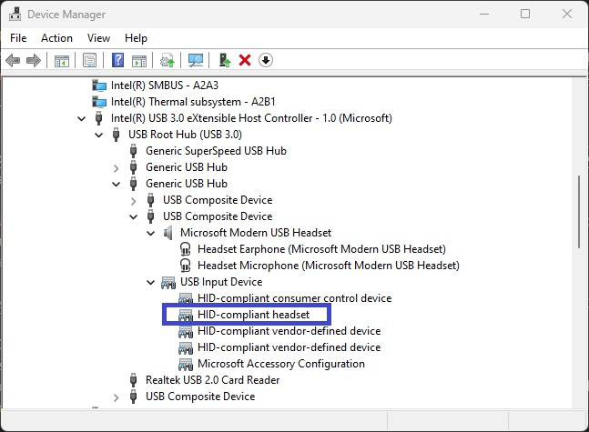
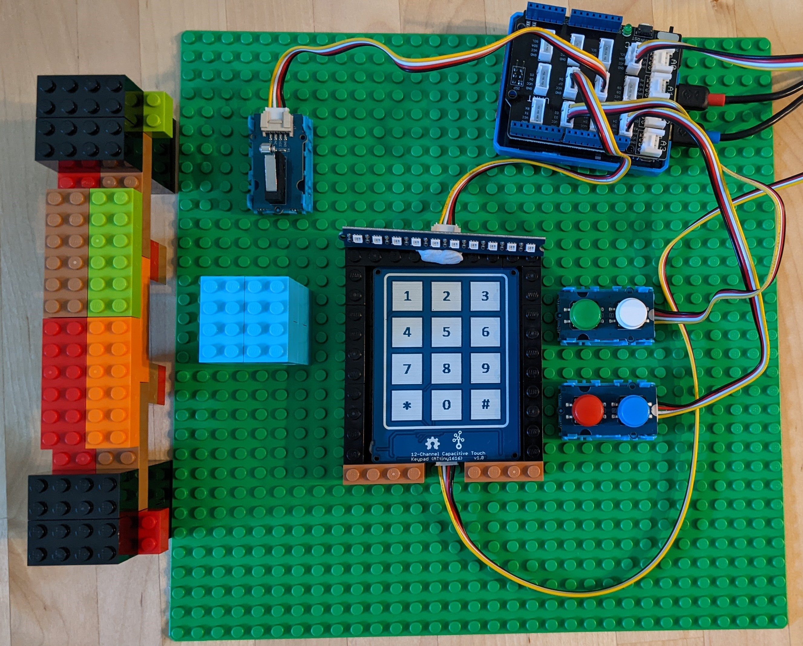

# Background
Telephony devices are used to dial, answer and control calls on the Host.  They do not provide audio sources (e.g. microphones) or audio sinks (e.g. earphones), nor 'explicit' control over them.  They are however often combined with audio sources/sinks (e.g. as seen below for a [Microsoft Modern USB Headset](https://www.microsoft.com/en-us/microsoft-teams/across-devices/devices/product/microsoft-modern-usb-headset/887)), but do not need to be to provide useful functionality.

Windows has supported Telephony-devices since Windows 10 1809 (build 17763), and is integrated with [Phone Link App](https://www.microsoft.com/store/productId/9NMPJ99VJBWV) and [Microsoft Teams](https://www.microsoft.com/en-us/microsoft-teams/group-chat-software)

[Telephony HID Usages](https://usb.org/sites/default/files/hut1_4.pdf#page=113) describe the underlying interaction between Host and Device.  This interaction is implemented by `Microsoft_HidTelephonyHeadset`

# Building Sample Device
This section describes the hardware components (constituting the end-device) used for this sample.  Other configurations may require changes to the sample code to integrate with an alternate components or development-platform.

## Design
This sample utilizes the [Grove modular prototyping system](https://www.seeedstudio.com/category/Grove-c-1003.html) (by Seeed Studio), which includes many simple IO and sensor devices.  There are many other sources and methods to interact with similar components, but require additional components (e.g. resistors), so for simplicitly of this sample, Grove was chosen.

Lego was chosen to create a 'mock' phone-headset (actuating the hook-switch) and base-station and to serve for component mounting.  *Note: Grove module wrappers can attach to Lego.*

An Arduino Zero is chosen because of it's native USB support (via Atmel SAMD21 microcontroller) and friendly EDBG for source-debugging.

*Note: The Arduino Grove Base-shield has 2 voltage options:- 3.3v & 5v (adjustable via a switch next to A0 port.  For Arduino Zero, this must be set to 3.3v*.

## Components
- [Arduino Zero](https://store-usa.arduino.cc/products/arduino-zero?selectedStore=us)
- [Arduino Zero Case](https://store-usa.arduino.cc/products/arduino-zero-case?variant=40735839748303)
- [Arduino Grove Base-shield](https://store-usa.arduino.cc/products/grove-base-shield-v2-0-for-arduino?selectedStore=us)
- [Grove Dual Button](https://www.seeedstudio.com/Grove-Dual-Button-p-4529.html) x 2
- [Grove Microswitch](https://www.seeedstudio.com/Grove-Micro-Switch.html)
- [Grove RGB Stick](https://www.seeedstudio.com/Grove-RGB-LED-Stick-10-WS2813-Mini.html)
- [Grove Capactive Keypad](https://www.seeedstudio.com/Grove-12-Channel-Capacitive-Touch-Keypad-ATtiny1616-p-4068.html)
- Multiple [Grove module wrappers](https://www.seeedstudio.com/Grove-Blue-Wrapper-1-2-4-PCS-pack.html)
- Multiple [Grove 4-pin cables](https://www.seeedstudio.com/Grove-Universal-4-Pin-Buckled-20cm-Cable-5-PCs-pack.html)
- Lego (assorted)

# Troubleshooting
- Validate connected to a Windows 10/11 system (untested on non-Windows systems (e.g. macOS, Linux, etc…))
- Validated with latest (1.8.13) [SAMD Arduino Core](https://github.com/arduino/ArduinoCore-samd), earlier versions may not have required USBCore fixes.
- Sample does not work with Adafruit SAMD21 boards as the [Adafruit fork](https://github.com/adafruit/ArduinoCore-samd) of the [SAMD Arduino Core](https://github.com/arduino/ArduinoCore-samd) isn't aligned with the official, which now contains several important fixes in USBCore regarding control-transfers and max-descriptor size.
- If using an Arduino Zero, ensure the 'Arduino Grove Base-shield' shield is switched to 3.3v.